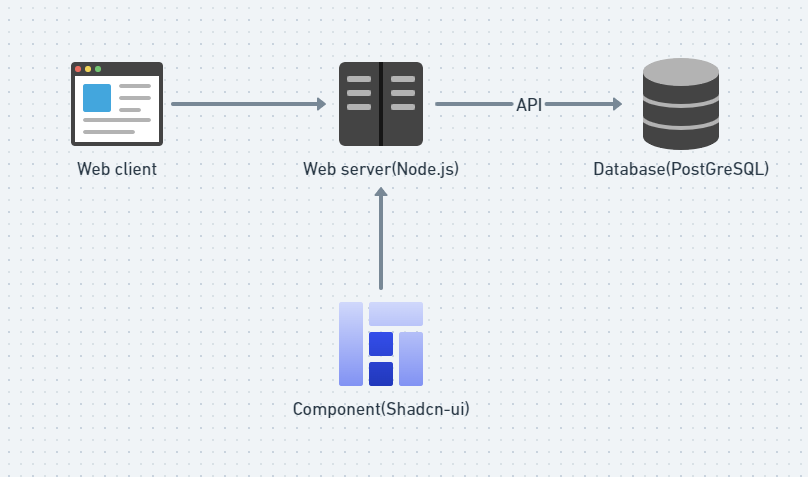
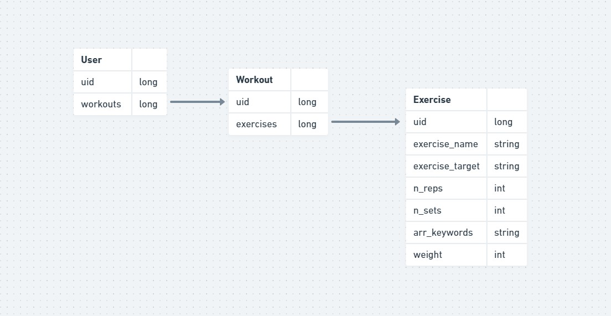

# MuscleMate Web Application Architecture

This document describes the overall architecture of the Muscle Mate Application. 

## Highlevel Component Digram

User using browser to open up the web application which is created using node.js with components from shadcn_ui <https://github.com/shadcn-ui/ui>. Then the frontend using api to 
communicate with the backend for pulling up existing data from the user and allows user to put in new data.

## Relationship Diagram

There are users, who have workouts created by themselves, which is composed of exercises having characteristics such as id, name, sets/reps, etc. 

## Flow Diagram

The user on his workout page decide to add a workout, a form opens up for the user to complete which he/she will choose the workout, sets, reps, etc. Then the backend stores the data, 
comfirms with the frontend, and the frontend shows confirmation message and shows the added workout. 
