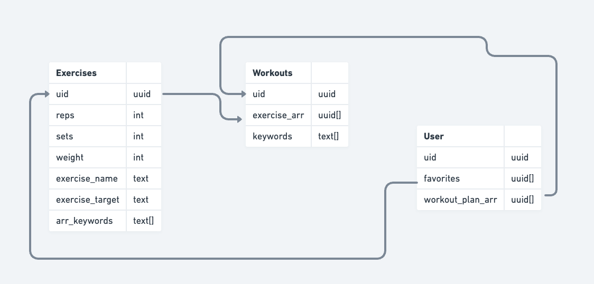
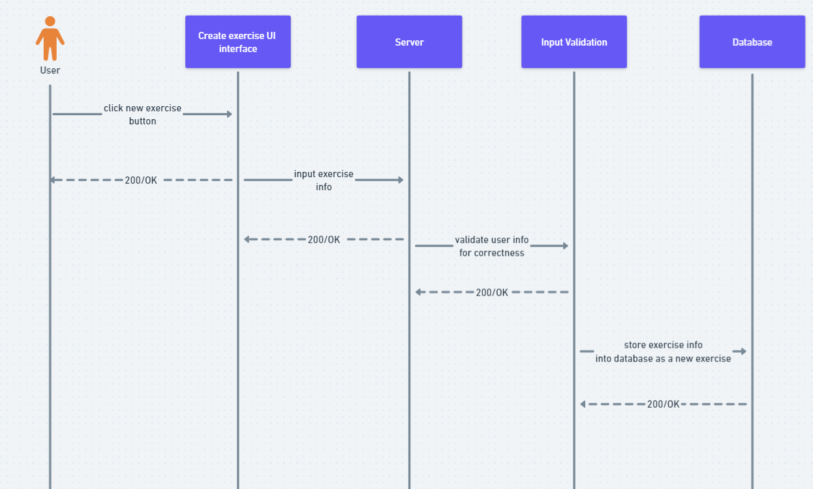

# MusclMate Architecture

These are the components of MusclMate. A web client will communicate with our server to display exercise data stored in our database, or add new data to the database.

These are the tables of our database. The three tables each have a uuid for their respective datatype as a primary key. A user can have many favorited exercises, and many custom-made workouts. A workout can have many exercises.

This is the flow of data when a custom exercise is added to the database. 

