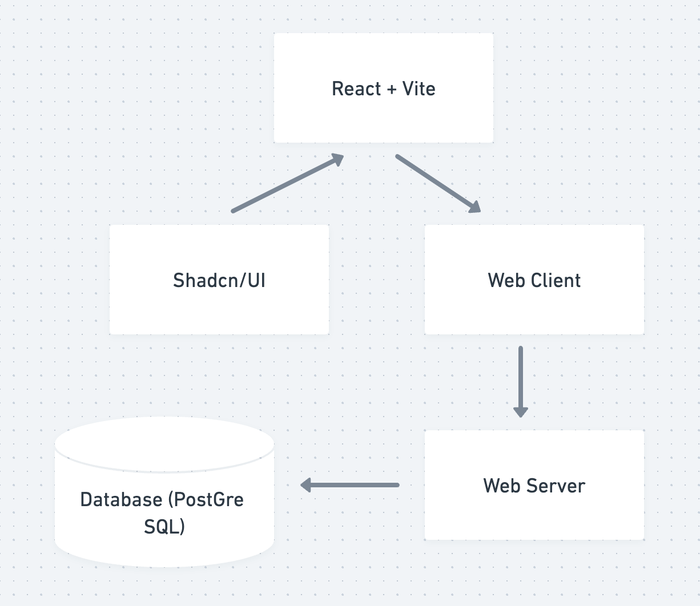
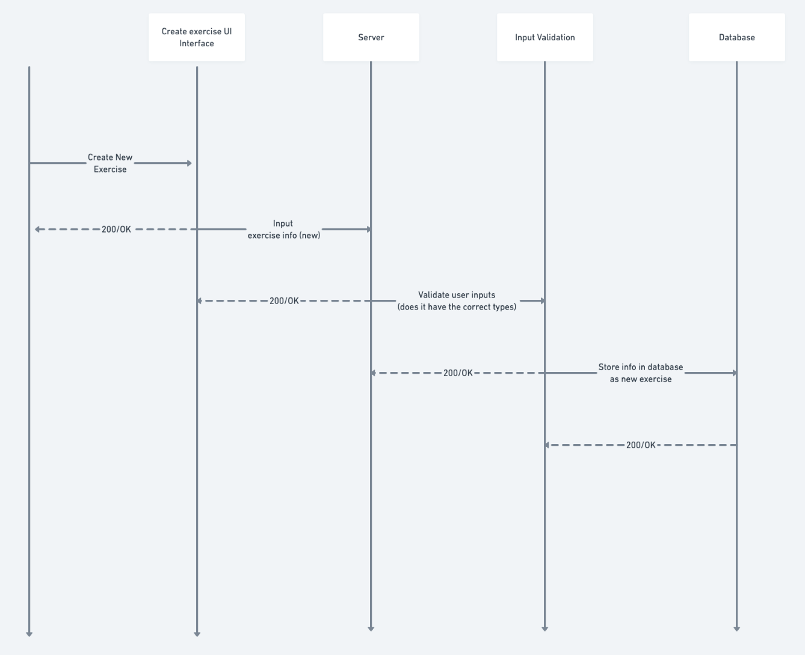

# MusclMate Architecture 

To make a website with a modern look we decided to use Shadcn/ui, and to implement it we used react and vite. The web client from there can communicate with our web server to access exercise data from our database (PostGre SQL) or decide to add new data into it.

There are 3 tables and each table has its own uuid for their own database. Every user will have their own uid, and favorites. work_out_arr is a list of workouts that is custom made by the user, and workouts are composed of n number of exercises.

This diagram illustrates the flow of data when a new exercise is created. When a user wants to create a new exercise they will be prompted to input all new exercise information (name, target, etc) which will be sent to the server. The server will then validate that information. If it is valid the data will then be added into the database.