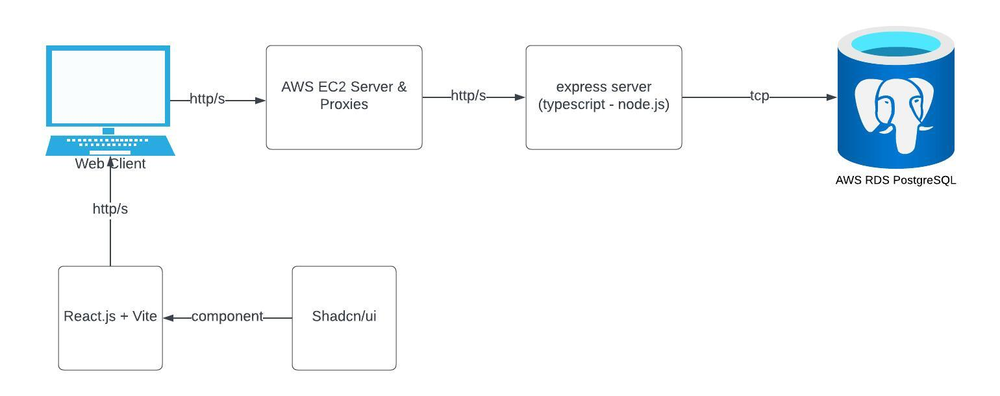
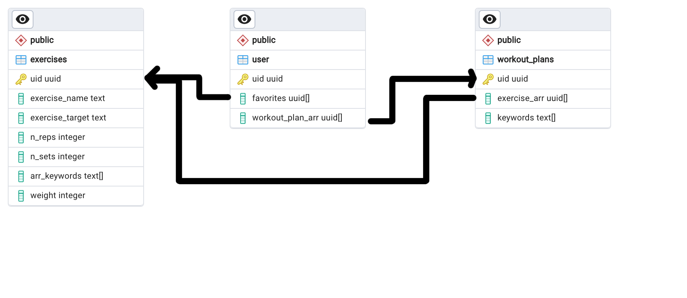
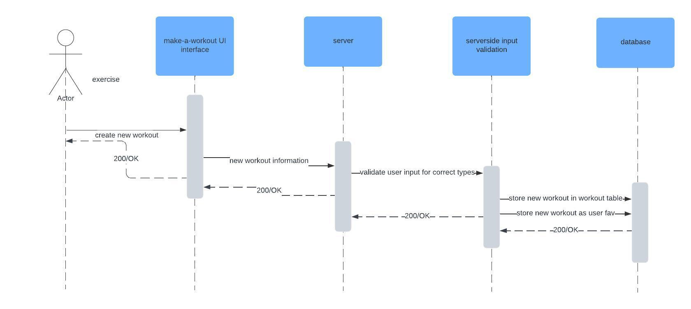

# MusclMate Application Architecture

This document describes the overall architecture of the MusclMate Web Application. 

## Highlevel Component Digram

The webclient's UI is served with React.js + Vite, using components from the [Shadcn/ui](https://ui.shadcn.com/) library to create a modern looking user interface. The UI is served in CI/CD via Vercel - which deploys all changes to the main branch to our [production web page](muscl-mate.vercel.app) through github actions. 

The server and all subsequent API interactions for the logic of the server currently go through an AWS EC2 instance on the free tier. This rotues our express server written in TypeScript to the internet, allowing it to be accessed from all devices via HTTP or HTTPS. Additionally, using AWS's RDS system, we have a Postgresql Database connected to the server - which allows storage of data that is served to the main page. In order for this to work, the EC2 instance and RDS instance had to share the same security group. 

Docker and Github actions are being explored to add continous devliery to the EC2 instance. 

## Relationship Diagram

As of this moment, we have three tables: exercises, user, workout_plans. The three represent the basic information we need on the site as of this moment, the exercises table contains all of the exercises and relevant information related to them. The user table contains basic user information that we can use in their session to show them their favorite exercises and workouts. This is done via arrays of unique IDs that correlate to a specific element in either table. The workout_plans table contains the UUIDs (in order) of the list of exercises contained within a workout. 

The exercises and workout tables all contain a "keywords" array which is a planned feature that allows us to search more efficiently based on semenatic meaning (embeddings, etc.). Currently they will only represent a certain topic that will be displayed on the user's interface. 

## Flow Diagram

The above flow diargam represents the sequence of events that undergo given all inputs are correct. The user's input will be sent to the server where the inputs are validated. This is done because we cannot send incorrect types to the "strongly typed" postgresql database. If a user's input violates this validation, a 400 response is sent back and they are asked to try again. Assuming the inputs were valid, the information is stored to the database of workouts, which has it's UUID updated on the user's favorite workout list. Once all of these are done, 200 responses are sent back until the user recieves confirmation. 