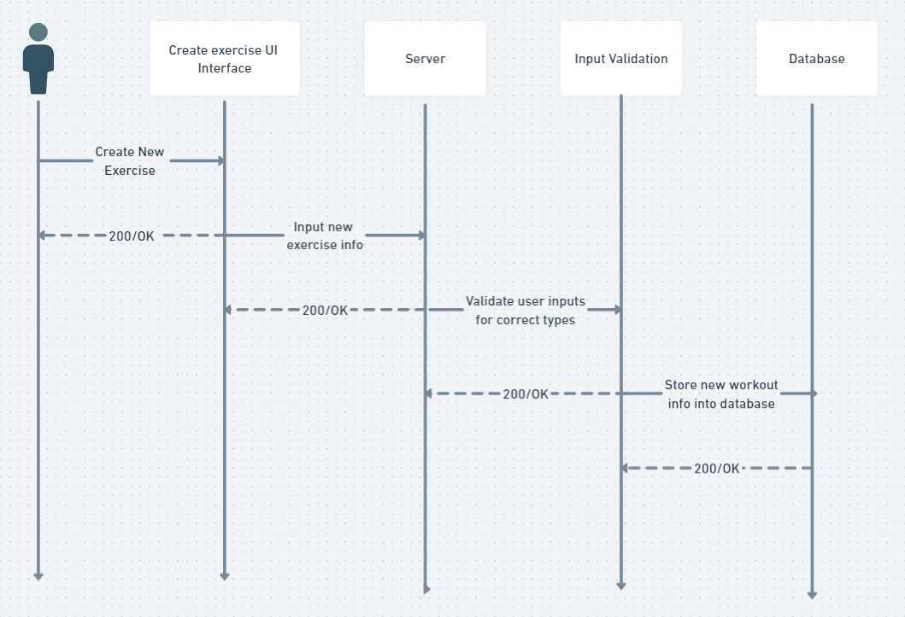

# MusclMate Architecture

## Component Diagram

These are all the components that are used for our project. As we can see, the web client utilizes shadcn UI components to make the website look more modern. We also use react and vite to implmenent these components to layout the website accordingly. From there, the web client will communicate with our server to display or add new exercise data to our PostGre SQL database.

## Entity Relationship Diagram

For our project, these are the tables of our database. The three tables each have uuid for their database and all link together with a column of one table connecting to the column of another. For example, each user will have their own uid as well as a favorites column that shows a list of the exercises that are favoritied which get stored using their uid. Furthermore, they also have another component called the workout_plan_arr which is a list of all the workouts that the user will include in their workout plan when customizing their routine. As for the relationship between the exercises and workouts, each workout is a list of exercises.

## Call Sequence Diagram

This is a diagram that illustrates the sequence of our program and how processes will run behind the scenes. First, the user can input new exercises which then get sent to the server. From there, the server will validate whether the information inputted is valid. If it is, then the exercise will get added to the PostGre SQL database. If all of the processes work accordingly, then a 200 response will get sent back, otherwise a 400 response gets sent back indicating that it was an error.